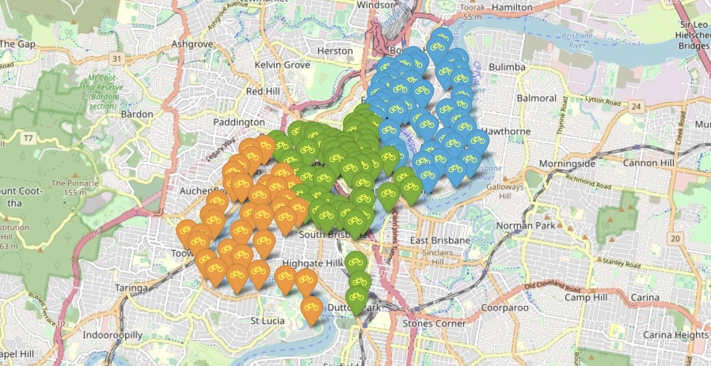

# BRISBANE-city-bike-clustering-kmeans
L'objectif principal de ce projet est de proposer un k-means clustering de Bristol City Bike en fonction de l'emplacement des stations vélos en utilisant spark.
<p align="center">

<p>

##### Table of Contents

- [Exécution du code sur linux](#Comment-exécution-du-code-sur-linux)
- [Données](#Données)
- [Moyennes pour chaque cluster](#Moyennes-pour-chaque-cluster)
- [Interprétation des résultats](#Interprétation-des-résultats)
- [Visualisation cartographique](#Visualisation-cartographique)

  
<br>

> Prerequisites
- Python 3.6+ 
- Java 8
- Spark 3.2.0
- PySpark 3.2.0
- Folium 0.12.1
- Pandas 1.2.4
<br>

> Description des fichiers
- data : dossier contenant les données Brisbane-City-Bike;
- exported : dossier contenant la bases fitted et la carte interactive de Brisbane;
- properties.conf : fichier de configuration pour le nombre de clusters kmeans, chemin d'exportation des données et chemin d'importation des données;
- run.py : script python du kmeans.

## Exécution du code sur linux
```sh
# Cloner le repertoire GIT
git clone https://github.com/ettouilebouael/BRISBANE-city-bike-clustering-kmeans.git

# Accèder au dossier du code
cd BRISBANE-city-bike-clustering-kmeans

# Executer le script
spark-submit run.py
```
<br>

## Données
Le fichier BRISBANE-city-bike.json  contient des informations concernant l’emplacement de chaque vélo. 
Le jeu de données se compose de 149 vélos avec les caractéristiques suivantes :
- adresse : lieu où se trouve le vélo
- number : numéro de chauqe vélo
- name : numéro + adresse
- Latitude
- Longitude

Notre objectif donc est de regrouper les vélos en utilisant k-means en fonction de leur emplacement géographique.

<br>

## Moyennes pour chaque cluster
### Avec DSL

|prediction|   Latitude_moyenne| Longitude_moyenne|
|:--------:|------------------:|-----------------:|
|         0| -27.47285783582089|153.02444714925372|
|         1|-27.460720829787235|153.04137646808513|
|         2|-27.482543657142866|153.00442045714286|
---------------------------------------------------

### Avec SQL
|prediction|   Latitude_moyenne| Longitude_moyenne|
|:---------|------------------:|-----------------:|
|         0| -27.47285783582089|153.02444714925372|
|         1|-27.460720829787235|153.04137646808513|
|         2|-27.482543657142866|153.00442045714286|
---------------------------------------------------
<br>

## Interprétation des résultats
Le kmeans distingue 3 clusters :
- Est : Vélos situés à l'est de la ville
- Centre : Vélos situés au centre de la ville
- Ouest :Vélos situés à l'ouest de la ville


## Visualisation cartographique
Pour illuster les clusters obtenus nous avons crée la carte suivante :



Une version interactive de la carte : [lien](https://htmlpreview.github.io/?https://raw.githubusercontent.com/ettouilebouael/BRISBANE-city-bike-clustering-kmeans/main/exported/carte_velo_brisbane.html)
``````````````````
